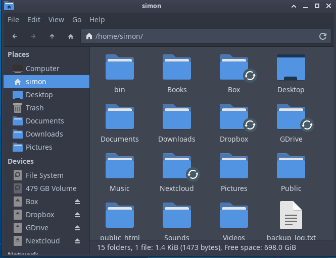

Let’s start by running the RCLONE configuration tool:

rclone config
Then use the following options:

<pre>n) New remote

name = nextcloud

type = webdav

url = https://<your nextcloud server url>/remote.php/webdav/

vendor = nextcloud

user = &lt;your nextcloud username&gt;

pass = &lt;your nextcloud user password&gt;

bearer_token = Remote config
</pre>
This sets the configuration, in rclone, then we need to mount it on login.

Here we add this as a startup option or to your startup script
<pre>
rclone mount nextcloud: ~/Nextcloud --daemon --vfs-cache-mode writes &
</pre>

The directory ~/Nextcloud must exist and be empty.

It is then shown as a remote filesystem in your filemanager

You can use this for all supported places, as shown above, Box, Dropbox, Google Drive etc.