I have installed Windows 11 before but there were registry edits to make the install work. Rufus negates the need for these. 

When creating the USB stick you get these options
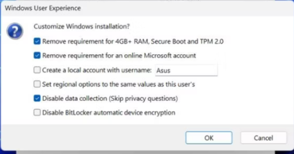

So create the USB drive and then start a new VM machine in QEMU
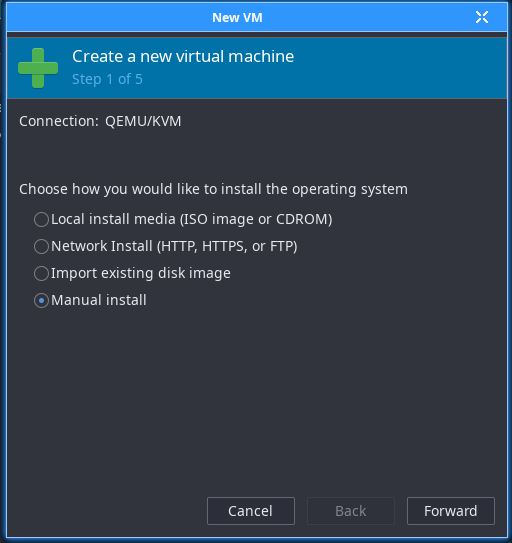

Choose Manual install
Then Windows 11

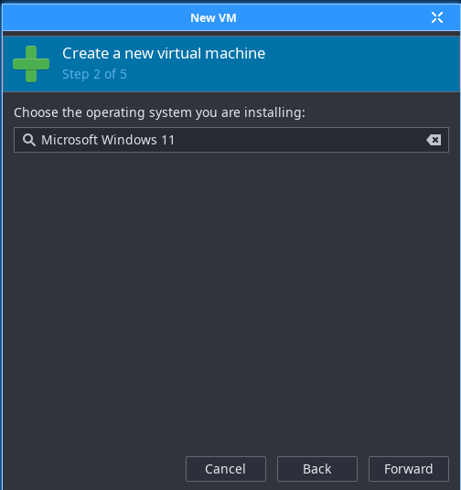

Choose your settings

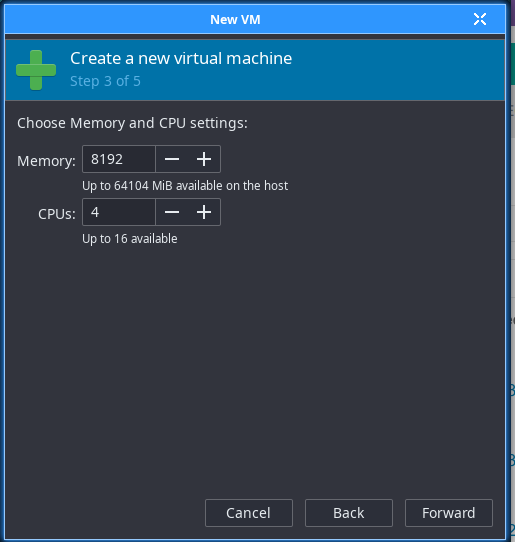
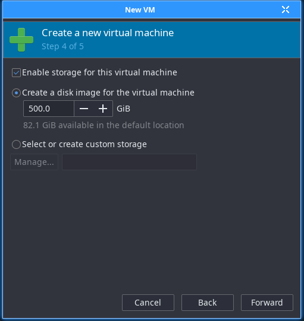

Check the box to customise before installation

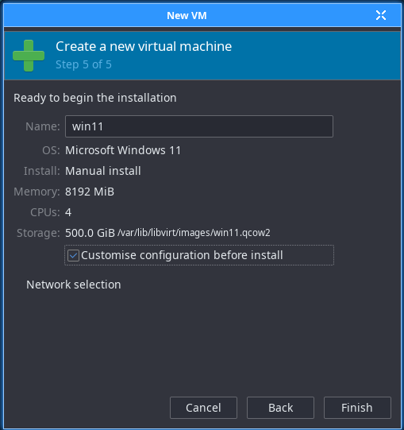

You need to add new hardware and add USB device and choose the stick you created with Rufus

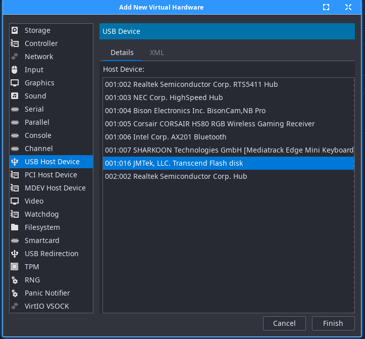

and add it to the boot options

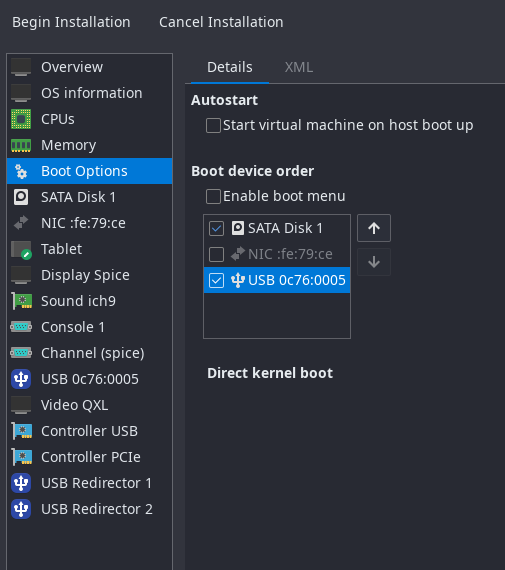

Turn off the network adapter

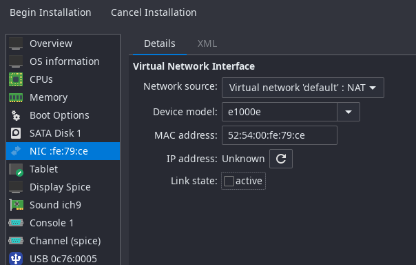

Then click begin installation

Windows will install without issue. When you get here, click I don't have internet

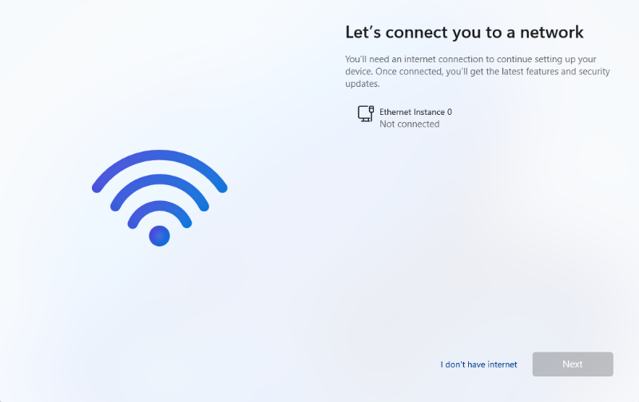

and then continue with limited setup

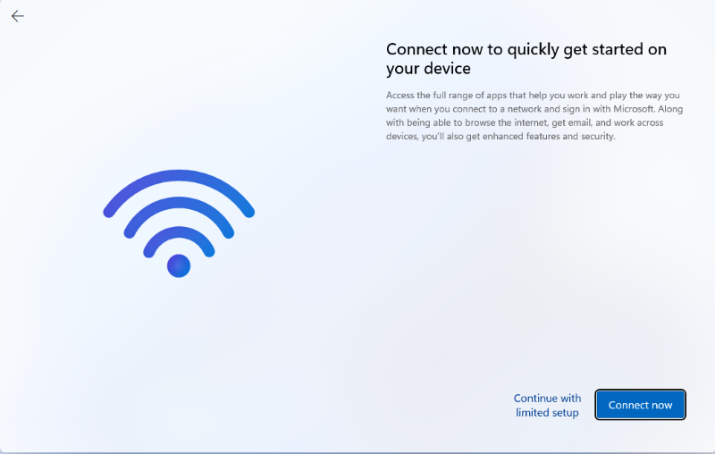

The installation is complete, shut down and turn the network on and remove the usb device.

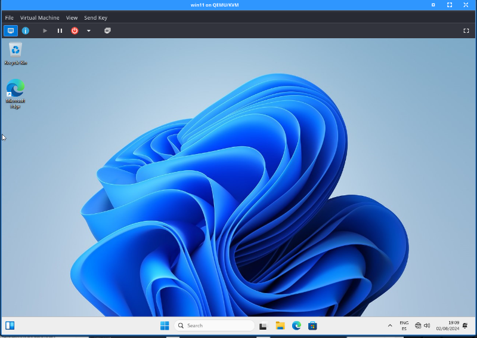

If you want to access a host directory, you can add using the virtual file system.
Click memory and tick share memory.

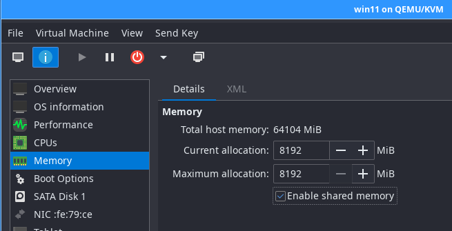

Add new hardware, add file system. Click browse, browse local and choose the directory to share.

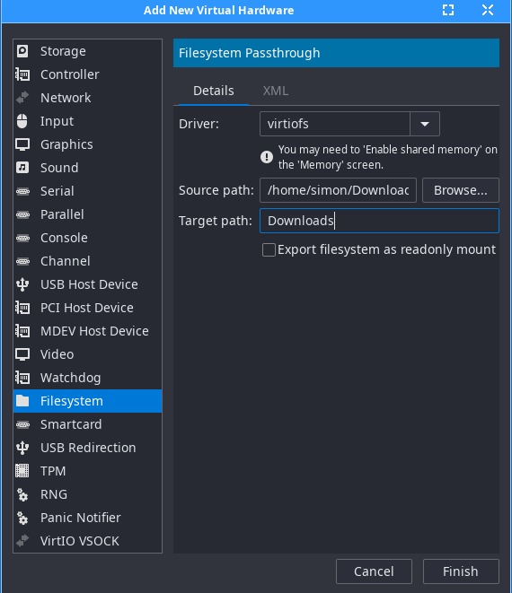

Shut the machine down to complete the changes.
Start the machine and in Windows download the virtio-win iso and winsfsp from the github site.

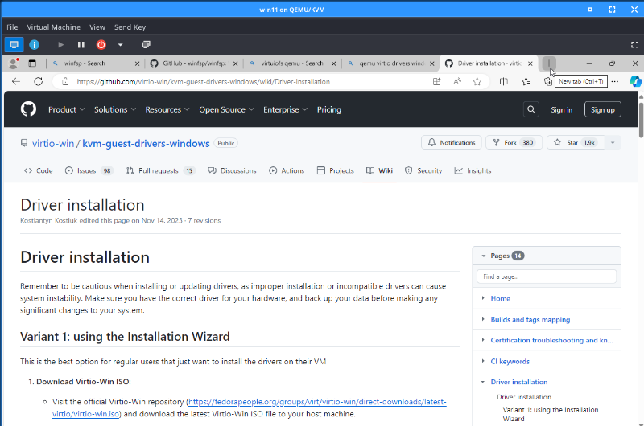
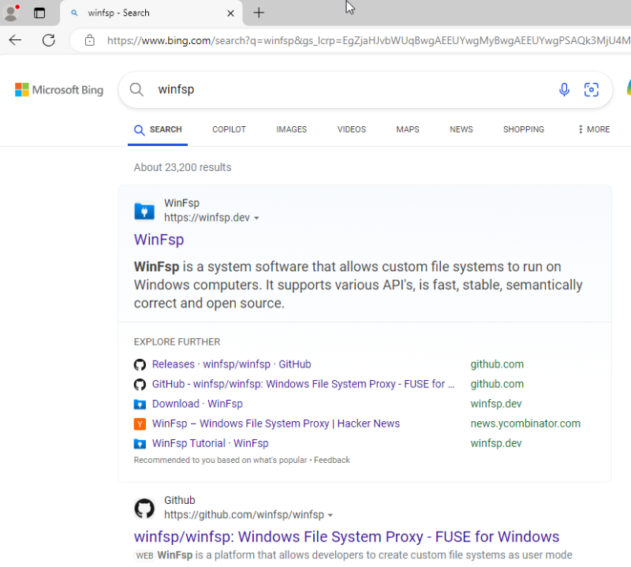

Install the app and then open windows services and find the VirtIO-FS service and change it to start Automatic and click start.
Click OK and close the services box.

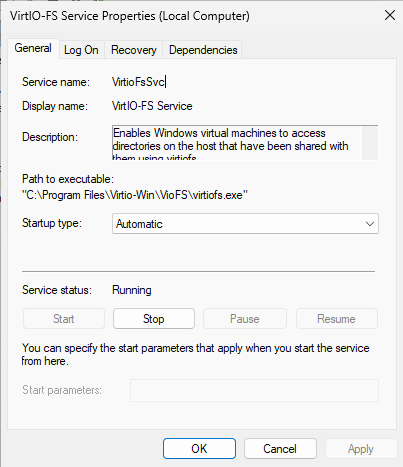

Open a file explorer and you will see the host directory in this PC

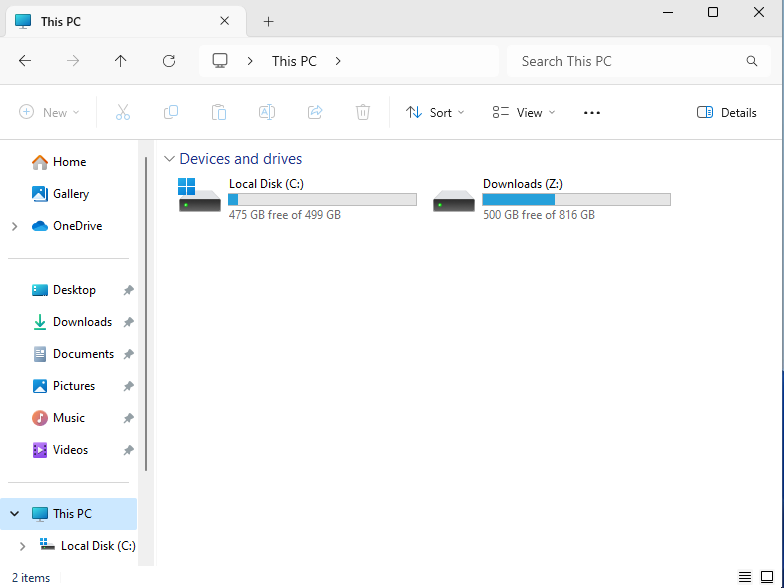

and we're done