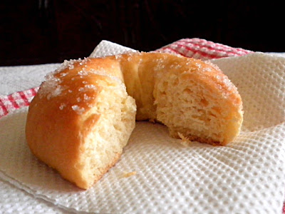

BAKED YEAST DOUGHNUTS
Yield : 10 doughnuts

2 Cups all purpose flour
50g melted butter
1.5 tsp instant yeast
1/2 Cup evaporated milk
1/4 Cup hot water
1 tablespoon sugar
1/2 tsp salt

COATING
1/4 Cup melted butter
1/4 Cup sugar
1 tsp cinnamon

METHOD

Combine melted butter, milk and hot water in a small bowl.

Mix together flour, yeast, sugar and salt in a mixing bowl.

Add milk mixture to the dry ingredients, forms into soft dough.

Knead by hand on floured board for 8 minutes until smooth,

Transfer into covered and oiled bowl, let rise until doubled for 1.5 hours.

Punch down dough, roll out about 1/8 in thick. Cut out into round using 2 in cookie cutter or use doughnut cutter if you have. Using small cutter to make a hole. Transfer doughnut onto baking sheet.

Let the dough sit for 45 minutes. Towards the end of rising time, preheat oven @ 190C.

Combine sugar and cinnamon for coating.

Bake 10-15 minutes until golden brown.

Remove from the oven, brush with melted butter and roll in cinnamon sugar.

Cool on rack.

