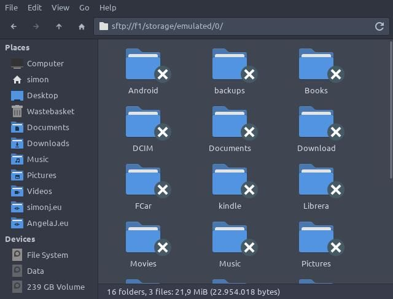

# Dropbear setup

Using dropbear is a simple way to access other file systems, whether on Linux or Android.

This is how I setup the Android app <a href="https://play.google.com/store/apps/details?id=org.galexander.sshd" target="dropbear">SimpleSSHD</a>

On the phone I setup the ssh directory to /storage/0/ssh

I run the app and reset the keys and verify the directory has the dropbear configuration files.

On my linux system I run
```
ssh-keygen -t rsa

Generating public/private rsa key pair.
Enter file in which to save the key (/home/simon/.ssh/id_rsa): 
/home/simon/.ssh/id_rsa already exists.
Overwrite (y/n)? y
Enter passphrase (empty for no passphrase): 
Enter same passphrase again: 
Your identification has been saved in /home/simon/.ssh/id_rsa
Your public key has been saved in /home/simon/.ssh/id_rsa.pub
```
This generates the files, but then I need to copy and rename the file to Android. 
```
cp /home/simon/.ssh/id_rsa.pub /home/simon/authorised_keys
```
I then copy (using a cable) this authorised keys into the directory on the phone /storage/0/ssh/

I then create a config file in .ssh called config
```
Host 192.168.0.247
Port 2222

Host f1
Port 2222
```
This redirects all ssh to port 2222 for the ip address of the phone and the name in /etc/hosts

I run the SSH app on the phone and I can log in with Thunar or via the terminal
```
 ssh f1
:/ $ cd /storage/emulated/0
:/storage/emulated/0 $ ls
Android Documents Librera Pictures       backups           ssh 
Books   Download  Movies  Power\ Toggles Telegram                   kindle            
DCIM    FCar      Music   Signal        
:/storage/emulated/0 $ exit
Connection to f1 closed.
```
In Thunar you need to supply a full path that is accessible by the user, /storage is not readable.


If this is not the only machine to access the phone you would need to get the authorized_keys file from the phone and append the new key.
```
cat  /home/simon/.ssh/id_rsa.pub >>/home/simon/authorised_keys
```
Then copy file back into the /storage/emulated/0/ssh directory. All other steps are the same.

---

!!! note inline "Posted" 

    08:48 23-08-2021
