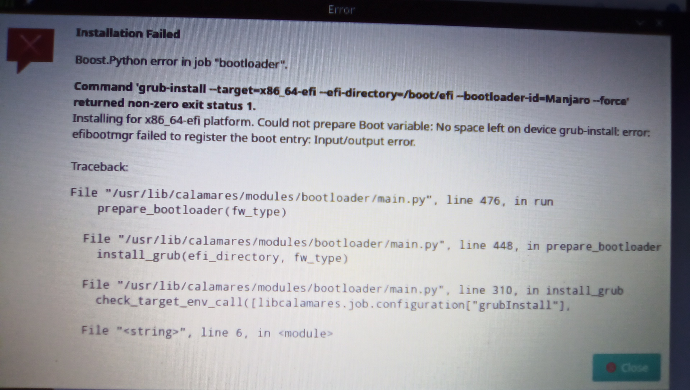

# Endeavouros onto Chromebook

Having tried Manjaro I decided to give Endeavouros a go and the same problem, with a similar fix.

I then booted this on the Chromebook and the install worked until installing bootloader failed.

The solution is to open a terminal and enter
```
chroot /tmp/calamares-root<numbers>
```
Hint: use tab to complete the numbers after root

Then retype the failed command and add
```
--no-nvram --removable
```
Hint : If you leave the installer error visible you can copy and paste into the terminal (CTRL+SHIFT+V)

This works without error.

Then type 
```
sudo grub-mkconfig -o /boot/grub/grub.cfg
```
Then run the cleanup script
```
chrooted_cleaner_script.sh
```
and then 
```
exit
```

Reboot and all should be good.

---

!!! note inline "Posted" 

    05-05-2021 07:36
