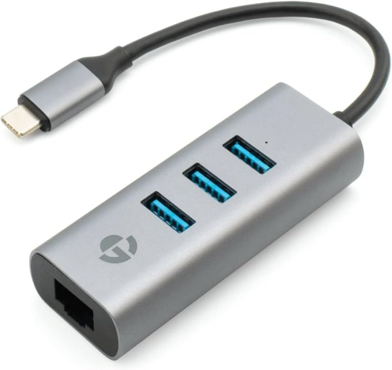

# GRAVITY Hub Mini Arch Network


I bought this hub for the USB ports and it is plug and play in Arch. No issues at all, until I plugged an Ethernet cable in to connect a wired network and nothing. 

Checking in the system is shows up as 
```
Bus 002 Device 005: ID 2109:0817 VIA Labs, Inc. USB3.0 Hub     
```
A quick search and this might be a Realtek r8152, so I installed the driver from the AUR
```
r8152-dkms
```
ran 
```
modprobe r8152-dkms
```
and plugged the cable in and it worked instantly.

---

!!! note inline "Posted" 

    14:03 06-05-2025
