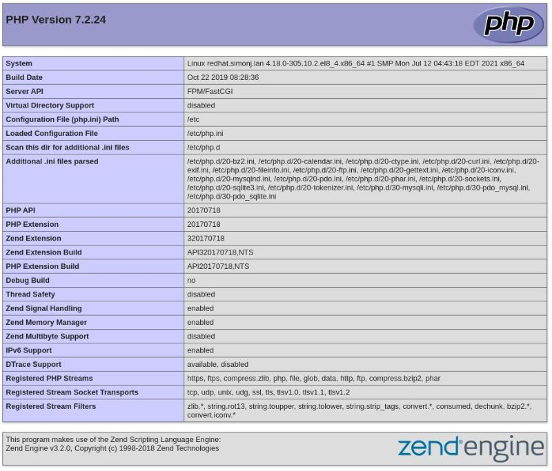

# Lighting the LAMP on Red Hat Linux

To get the basics started you can follow these commands :
Ensure the system is up to date.
```
dnf -y update
```
Install Apache
```
dnf -y install httpd
```
Enable and start the service
```
systemctl enable --now httpd
```
Allow access to port 80 through the firewall
```
firewall-cmd --zone=public --add-port=80/tcp --permanent
```
Reload the firewall with the new rule
```
firewall-cmd --reload
```
Install mysql
```
dnf -y install mysql-server mysql
```
Enable and start it
```
systemctl enable --now mysqld
```
then type this command and follow the prompts to secure the installation.
```
mysql_secure_installation

By default, a MySQL installation has an anonymous user,
allowing anyone to log into MySQL without having to have
a user account created for them. This is intended only for
testing, and to make the installation go a bit smoother.
You should remove them before moving into a production
environment.

Remove anonymous users? (Press y|Y for Yes, any other key for No) : y
Success.


Normally, root should only be allowed to connect from
'localhost'. This ensures that someone cannot guess at
the root password from the network.

Disallow root login remotely? (Press y|Y for Yes, any other key for No) : y
Success.

By default, MySQL comes with a database named 'test' that
anyone can access. This is also intended only for testing,
and should be removed before moving into a production
environment.


Remove test database and access to it? (Press y|Y for Yes, any other key for No) : y
 - Dropping test database...
Success.

 - Removing privileges on test database...
Success.

Reloading the privilege tables will ensure that all changes
made so far will take effect immediately.

Reload privilege tables now? (Press y|Y for Yes, any other key for No) : y
Success.

All done! 
```
Now install PHP
```
dnf -y install php php-mysqlnd php-cli
```
and restart apache to enable it
```
systemctl restart httpd.service
```
Create a test php file

```
nano /var/www/html/test.php
```
And put this in it, and save the file.
```
&lt;?php
phpinfo();
?&gt;
```

No go to your server IP address /test.php

```
http://192.168.0.252/test.php
```
And you should see this
 
 
 
 ---

!!! note inline "Posted" 

    19:19 30-07-2021
