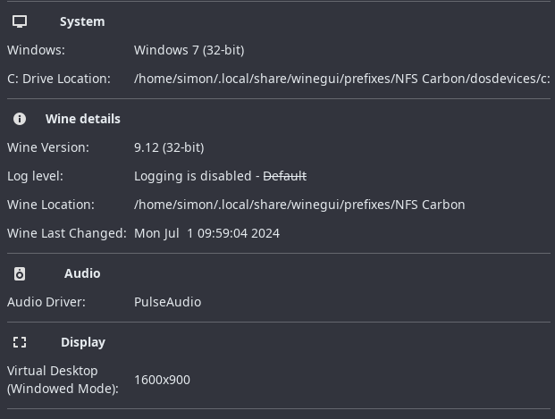
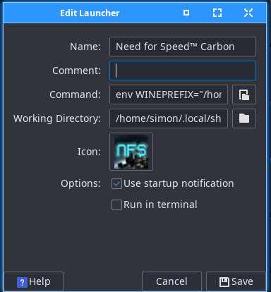
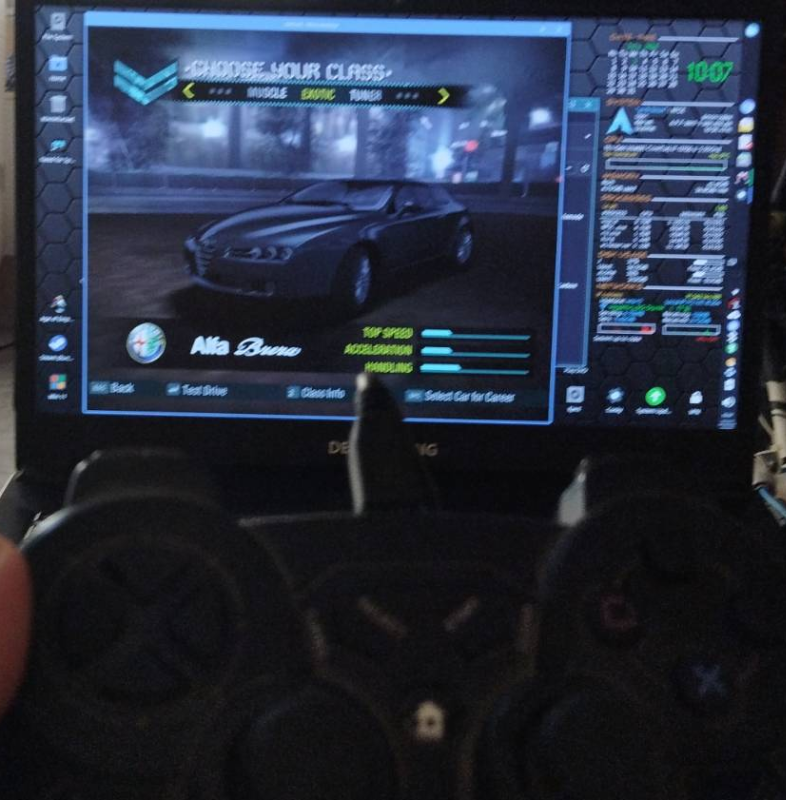

# Need for Speed™ Carbon on Arch using WineGUI

It's 2024 and I still like Need for Speed™ Carbon.

It has been around a long time and I have played newer versions but this still is the one I enjoy most.

Back when it was released I had to run it on Windows, Linux could not emulate the environment needed for games. Today 99% of my games are in Steam. NFS Carbon is not available in Steam, if it was, I would just have bought it again.

So, to get this running on Arch Linux. I am not a Wine guru, so I installed WineGUI from the AUR.

I chose Windows 7 (seems a good fit) and of course 32 bit. These are the settings I used


I decided to create an ISO image, in case I needed it to run the game all the time. To get the info to do this I ran
```
isoinfo -d -i /dev/cdrom | grep -i -E 'block size|volume size'
```
This gives the values needed to create the ISO with
```
dd if=/dev/cdrom of=NFSC.iso bs=2048 count=1878560
```
I then put the disc away and copied the game key into Keepass for easy reference. 

I mounted the ISO to /mnt
```
sudo mkdir /mnt/NFS
sudo mount -o loop NFSC.iso /mnt/NFS/
```
This shows up in WineGUI as drive d:

I completed the install as though in Windows, skipping the registration as the EA server is no longer there.

I did copy a no CD application so I would not need the ISO mounted all the time.
I removed the mount with 
```
sudo umount /mnt/NFS 
sudo rmdir /mnt/NFS/
```
Then to create a launcher.
Name
```
Need for Speed™ Carbon
```
Command
```
env WINEPREFIX="/home/simon/.local/share/winegui/prefixes/NFS Carbon" wine "/home/simon/.local/share/winegui/prefixes/NFS Carbon/dosdevices/c:/Program Files/Electronic Arts/Need for Speed Carbon/NFSC.exe"
```
Working Directory
```
/home/simon/.local/share/winegui/prefixes/NFS Carbon/dosdevices/c:/Program Files/Electronic Arts/Need for Speed Carbon
```
You will need to change these to suit your setup, but you get the idea.
Add the icon as shown



Mark the launcher executable, and off we go! All movies work, sound works and most importantly the USB controller works!

Done!

Happily playing Need for Speed™ Carbon in 2024! 

---

!!! note inline "Posted" 

    12:48 03-07-2024
