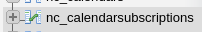
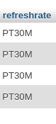

The default fix for setting a manual refresh time is using the terminal on the server. Having set up an instance of Nextcloud without terminal access I needed to find an alternate way to achieve this. It turns out the official method is simply a way to edit the fields in the database, I can do this in PHPMyAdmin directly.

Simply go to to the Nextcloud database and find the subscriptions table

Then edit the refresh rate to the same value as other guides, I set mine to 30 minutes. 

This will instantly change the time but you will need to wait for the refresh time to elapse.

Along with the cron job running this solves all the problems with web calendars.

---

!!! note inline "Posted" 

    09:17 08-09-2022
