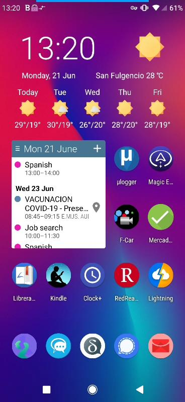

We don't get very good phone reception at home and many things are moving to SMS codes to confirm logins. 

The problem is receving a code means going out into the street or upstairs to get signal, then going back to the computer before the code expires.

A solution is an Android screen sharing program so I can leave the phone upstairs and view from my computer, enter [scrcpy](https://github.com/Genymobile/scrcpy?target=scrcpy)

To install this you just need to type 
```
paru -Syu scrcpy
```
Then to run it over wifi, setup and start adb over wifi on the phone and then create a bash script with this in
```
#!/bin/bash
while ! ping -c 1 -W 1 192.168.0.247; do
	notify-send --icon computer 'Waiting on network'
    sleep 1
done
adb tcpip 5555
adb connect 192.168.0.247:5555
scrcpy -S --serial 192.168.0.247:5555 --bit-rate 4M --max-size 800
adb disconnect
adb kill-server
```
My phone has a static address of 192.168.0.247, change this to your phone's IP address.
Now I can view the screen and use my mouse as a remote finger. The script above starts ADB then connects to the static IP address and starts scrcpy, then when I close the window it shuts it all down again, ready for next time.



---

!!! note inline "Posted" 

    25-02-2023 12:10
