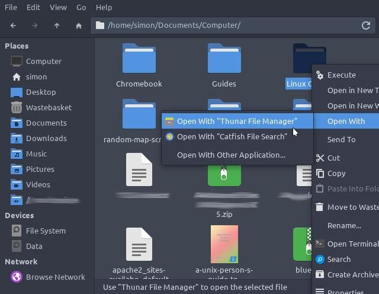

If I extract an archive with Archiver and then click Show Files, I was being presented with a catfish window instead of the thunar window expected.

I had a look at many options, mimetypes and default filetype settings, but nothing seemed to show a problem.

So then I went back to the thunar window, and right clicked a folder and oddly the default open with was, tada, catfish.

I right clicked and said "open with" and chose thunar, and now archiver opens with thunar as well.

It's a simple fix but only if you know where to look. I am glad I found it, I hope it helps someone else.

It survived a reboot so I am guessing it is fixed, for now. :)