As you may imagine, I have installed Windows 11 to see what has changed rather than getting excited about the new release. 

Having finished the installation and had quick look round it appears to be a minor update with yet another Start Menu. I don't mind this one but then I quite like KDE so maybe that is where Microsoft got their inspiration. 

Here is a gallery of the screenshots during installation. I am grateful there is still an offline account option, I half expected that to vanish too.

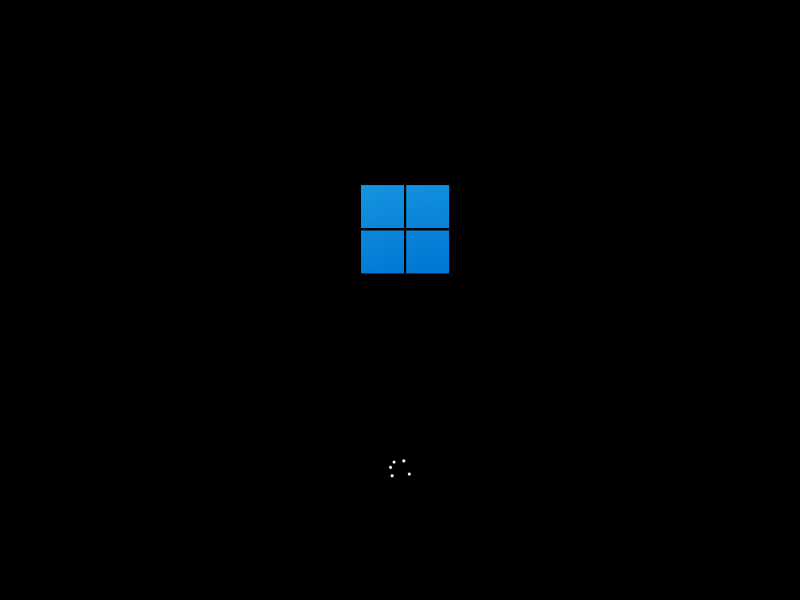
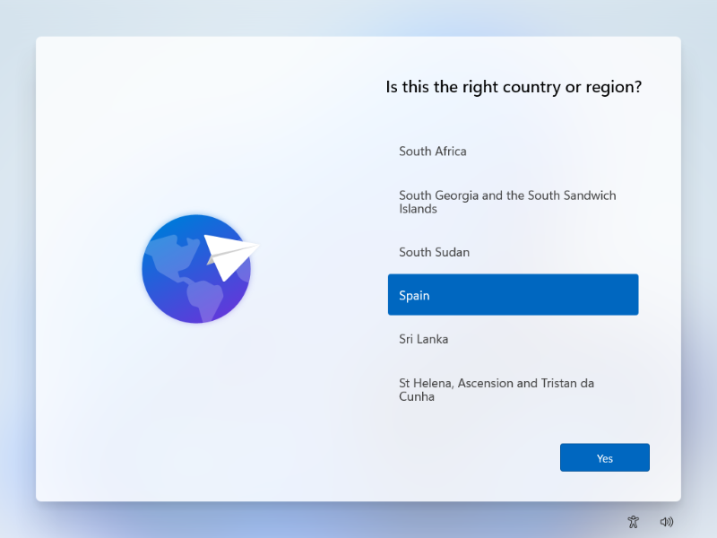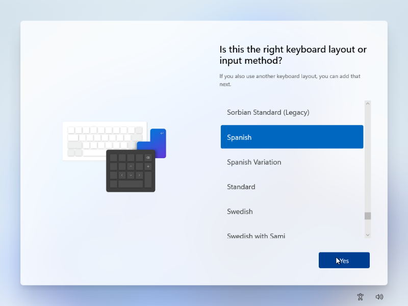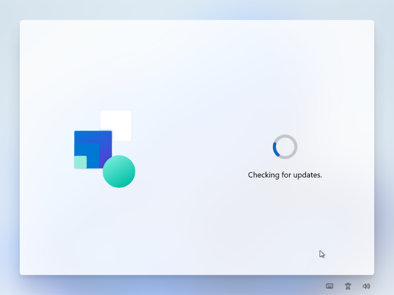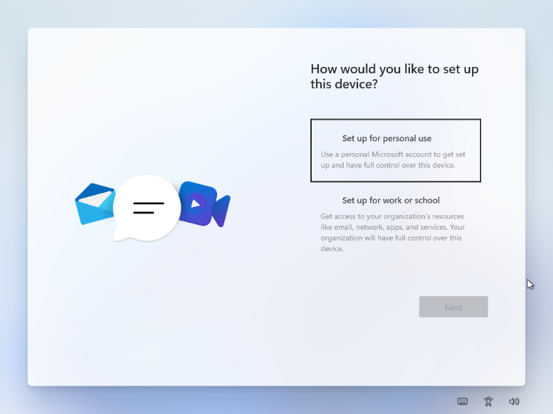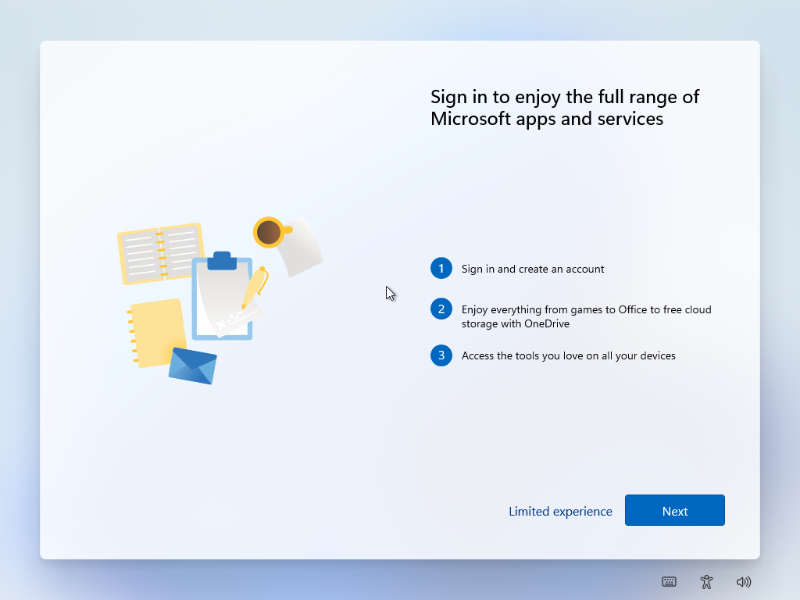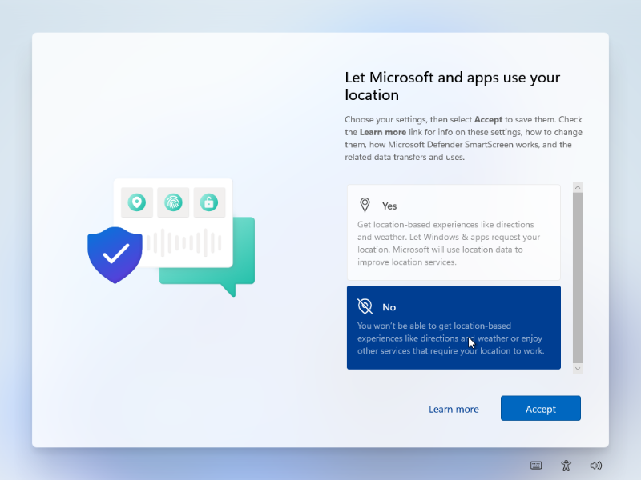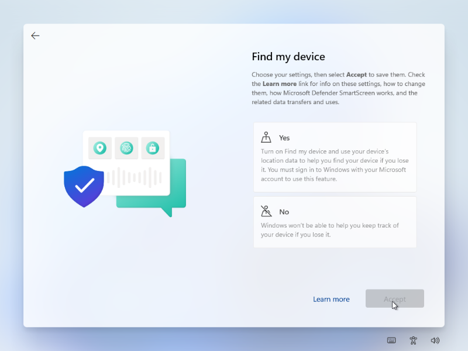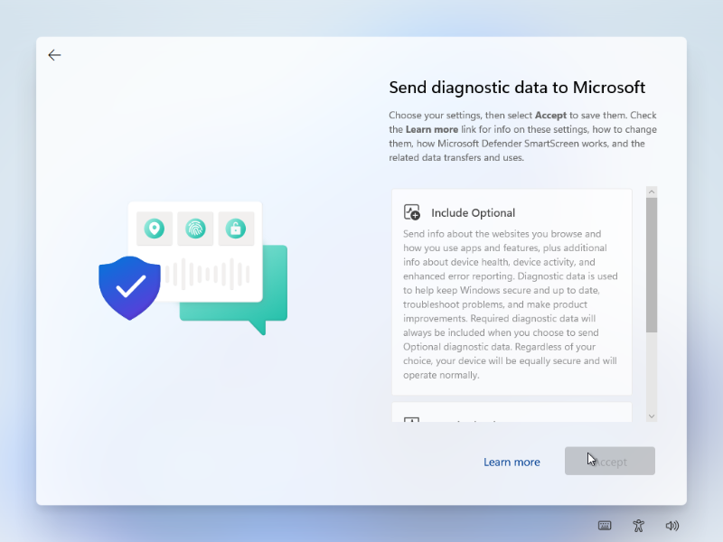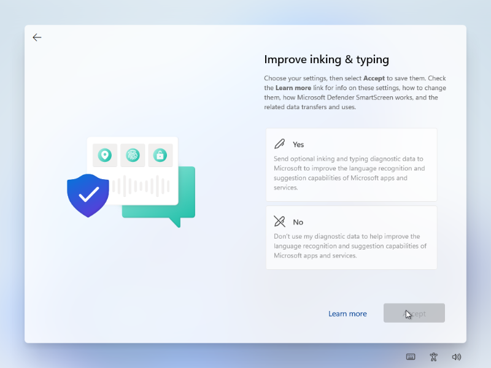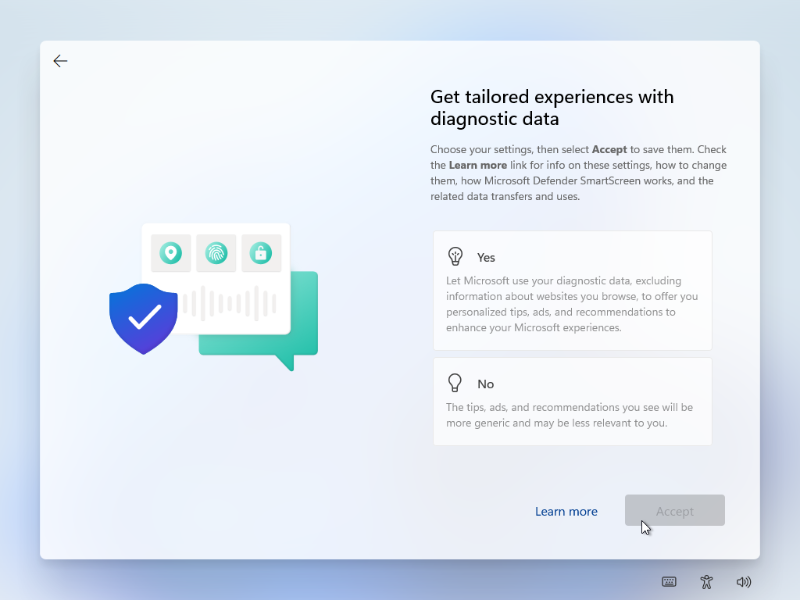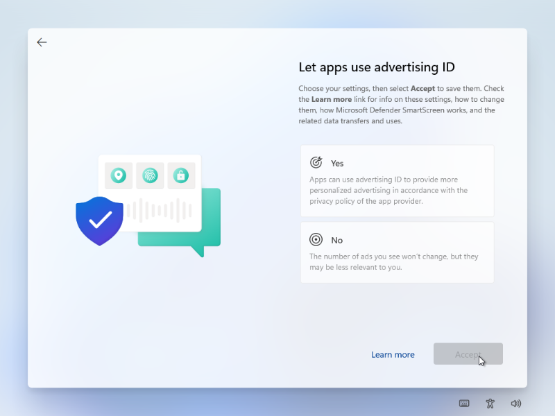
