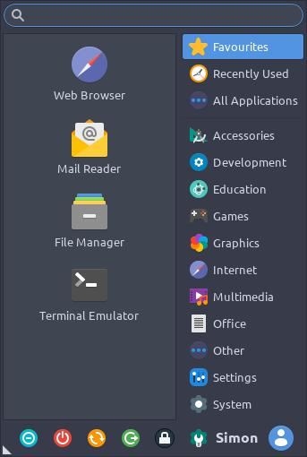

# XFCE Menu

Having used XFCE for many years, back to 1998 and Mandrake Linux, today I found the menu is resizable simply by grabbing the corner and dragging it.

It makes like a little bit tidier and of course is something someone has bothered to code into the program.

It's a happy day because I found it, I am not going to see how long it has been there as I would have used it back then also.

Picture in case my description is unclear.

Just grab the bottom left (in my case) corner with the mouse and drag to the size you want. Easy! 

---

!!! note inline "Posted" 

    23-06-2021 07:31
