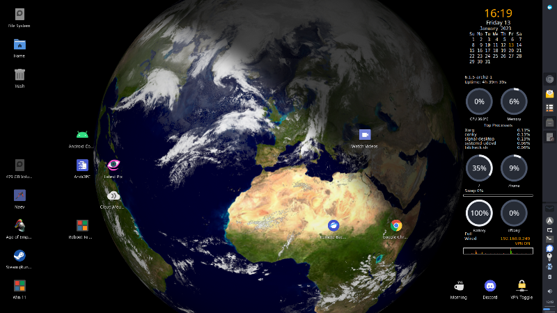
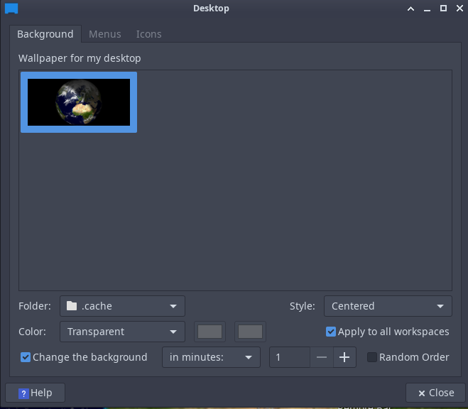

Many years ago I set up xplanet and used it for the desktop wallpaper, I thought I would have a go again in 2023 and see how easy it was. In short, it is not. 

The basic xplanet script works perfectly but the cloud data is no longer free, but after setting up an account at [Xeric Design](https://www.xericdesign.com/xplanet.php) (22€/year) all is working well and looks great as the desktop background.



To start the xplanet script 
```
xplanet -output ~/.cache/xplanet.png -geometry 2800x1280 --wait 60 -latitude 3 -latitude 40 -radius 50 &
```
This is overly zoomed to make my location more visible, and the script called hourly to update the clouds is 
```
#!/bin/bash

# Your username (license key) and password
user=&lt;username&gt;
pass=&lt;password&gt;

# Size of the map to download
pixels=2048

# Web address of the cloud map
remoteDir=https://secure.xericdesign.com/xplanet/clouds/${pixels}
cloudFile=clouds-${pixels}.jpg

# Where you want to put the cloud map
cd ${HOME}/.xplanet/images/

# Examples using wget and curl are below.

# Retrieve using wget, checking if the timestamp of the
# remote file is newer than the existing one.

wget -N --user=${user} --password=${pass} ${remoteDir}/${cloudFile}

# options to curl
curlOpts="-u ${user}:${pass} -R -L -o ${cloudFile}"

# if a cloud file exists, use its timestamp to determine
# whether to download the new one
if [ -f ${cloudFile} ]; then
curlOpts="-z ${cloudFile} ${curlOpts}"
fi
```
The xfce4 settings to use the wallpaper are: