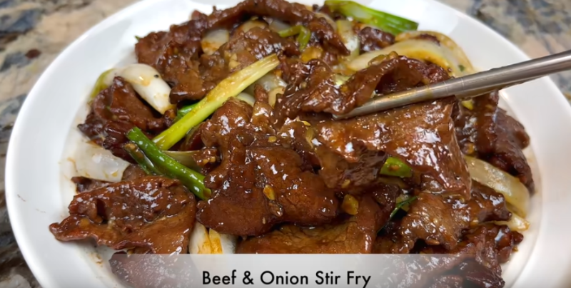

# Beef And Onion Stir Fry
<figure class="polaroid-box">
    
    <figcaption class="polaroid-caption"></figcaption>
</figure>
!!! success "Preparation"

    - Cut green onion in half to separate white and green parts. 
    - Slice white parts down the center in half. 
    - Then cut into two-inch slices. 
    - Cut green part into two-inch slices. 
    - Keep separate.
    - Cut white onion in half and then into large slices. Separate layers for quicker cooking. Set aside with whites of green onion as these will be cooked together.

!!! success "Slice beef into desired thickness. Thin or thicker is fine. Place into bowl then add the following:"
    
    - 2 tsp soy sauce
    - 2 1/4 tsp dark soy sauce
    - 3/4 tsp sugar
    -1 1/2 tsp baking soda
    - 4 1/2 tsp corn starch
    - Mix well.

!!! success "After mixing beef add:"
    
    - 1 tbsp oil
    - 1 1/2 tsp sesame oil
    - Mix again.

!!! success "Heat pan on medium high heat."

    - Add 1 1/2 tbsp oil
    - Add onion and white part of green onion.
    - Stir fry just enough to get rid of the raw spicy taste.
    - Season with 1/4 tsp sugar and 1/4 tsp salt.
    - Do not overcook as you want to keep the onion crunchy.
    - Remove when done.

!!! success Combine and serve

    - Add 1 1/2 tbsp oil to pan.

    - Add beef and spread out. Let beef pan fry until bottom is slightly brown and then turn over.

    - Add 1 1/2 tbsp rice wine into side of pan in order to bring out aroma of the rice wine.

    - After the rice wine evaporates add 1 tbsp of dark soy sauce and 1 1/2 tsp oyster sauce. Mix well.

    - Add 1/3 cup of water and let sauce thicken.

    - When sauce thickens add black pepper to taste.
    - Add green onion and regular onion.

    - Stir well to mix everything together. Enjoy!!
<!--  -->
