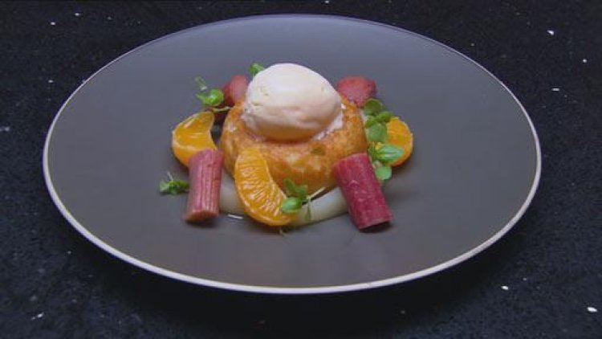

# Champagne Savarin

<figure class="polaroid-box">
    
    <figcaption class="polaroid-caption">Recipe by: Matt Moran</figcaption>
</figure>

!!! info "Ingredients - Savarin"

    - 25ml milk

    - 1 teaspoon honey

    - 6g dried yeast

    - 3 eggs

    - 150g plain flour

    - Pinch sea salt

    - 50g unsalted butter, diced

!!! info "Ingredients - Champagne soaking syrup"

    - 600ml champagne

    - 500ml water

    - 250g caster sugar

    - 1 vanilla bean, split

    - Baby basil, to serve

!!! success "METHOD - Savarin"

    - For savarin, preheat oven to 170°C and grease and flour 6x9cm savarin moulds.

    - Place milk, honey and yeast in a bowl. Whisk to a smooth paste and whisk in eggs.

    - Place flour and salt in the bowl of an electric mixer, with the motor running at a low speed, add yeast mixture and mix for a few minutes.

    - Remove from the mixer, sprinkle butter over the top of the dough but do not mix in. Cover with cling wrap and leave in a warm place to rise for 40 minutes or until nearly doubled in volume.

    - Mix in the butter with a wooden spoon and transfer dough into a piping bag. Pipe just enough dough to half fill prepared savarin mouldand leave to prove for 20 minutes until dough fills mould.

    - When savarins have doubled in volume, bake for 15-20 minutes or until golden.

!!! success "METHOD - Champagne Soaking Syrup"
    
    - For champagne soaking syrup, place the champagne, water, sugar and vanilla bean in a large saucepan over a medium heat andbring to the boil, stirring occasionally until sugar is dissolved. Remove from heat.

    - Turn savarins out of moulds and slip into the saucepan of hot syrup. Allow to soak for 2 minutes.

    - To serve, place a savarin in a serving bowl and surround with poached fruit. Garnish with basil, place a scoop of champagne ice cream in the centre of the savarin and serve immediately.
