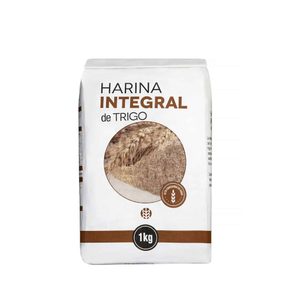

<!--  -->
# La masa simple
<figure class="polaroid-box">
    
    <figcaption class="polaroid-caption">The exact flour to use.</figcaption>
</figure>
!!! info "Ingredients"

    - 350g de harina

    - 150ml de agua

    - 100ml de aceite de oliva

!!! success "METHOD"

    - Preparamos la masa. Vertemos todos los ingredientes de la masa en un cuenco.
    - Amasamos bien.
