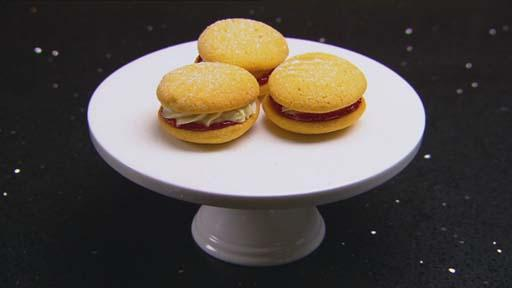

# Melting Moments
<figure class="polaroid-box">
    
    <figcaption class="polaroid-caption">From Masterchef Australia</figcaption>
</figure>
Makes: 10 sandwiched biscuits

!!! info "Ingredients - Biscuits"

    - 180g unsalted butter

    - 60g icing sugar, sifted

    - 60g cornflour

    - 1 teaspoon baking powder

    - 180g plain flour

!!! info "Ingredients - Vanilla buttercream"

    - 100g butter, softened

    - 2 teaspoons vanilla bean paste

    - 1 cupicing sugar, sifted

    - Raspberry jam

    - 250g fresh or frozen raspberries

    - 250g caster sugar

    - Juice of ½ a lemon

    - ½ teaspoon gelatine powder

    - Icing sugar, to serve

<!--  -->

!!! success "METHOD"

    - Preparation: 30 minutes
    - Cooking: 50 minutes

    - Preheat oven to 180°C. Line two oven trays with baking paper.

!!! success "METHOD - biscuits"

    - Cream butter for two minutes in an electric mixer with paddle attachment. 
    - Add icing sugar and custard powder and mix until combined. 
    - Sift the baking powder and flour together then add to the dough and mix well. 
    - Roll dough into 20g balls, place on a baking paper lined baking tray and press each ball with a fork to leave an indent. 
    - Bake biscuits for 16-18 minutes or until light golden. 
    - Stand on trays 5 minutes to cool then transfer to a wire rack to cool completely.

!!! success "METHOD - buttercream" 

    - Whisk butter and vanilla until smooth. 
    - Add icing sugar and beat until mixture forms a paste, the consistency of thick icing. 
    - Spoon into a piping bag fitted with a small star nozzle.

!!! success "METHOD - jam"

    - Place raspberries, sugar and lemon juice in a small saucepan and cook for 20-30 minutes until thickened. 
    - Mix gelatine powder with one tablespoon cold water together. 
    - Remove the jam from the heat, stir through gelatine mixture. 
    - Transfer to a heatproof bowl and cool in the fridge.

!!! success "METHOD - Assembly"
    
    - Place a spoonful of cooled jam on the base of half the biscuits. 
    
    - Pipe buttercream in a circle onto the base of the other half of the biscuits. 
    - Gently press one of each biscuit together to form a melting moment.
    - Dust with icing sugar before serving.
