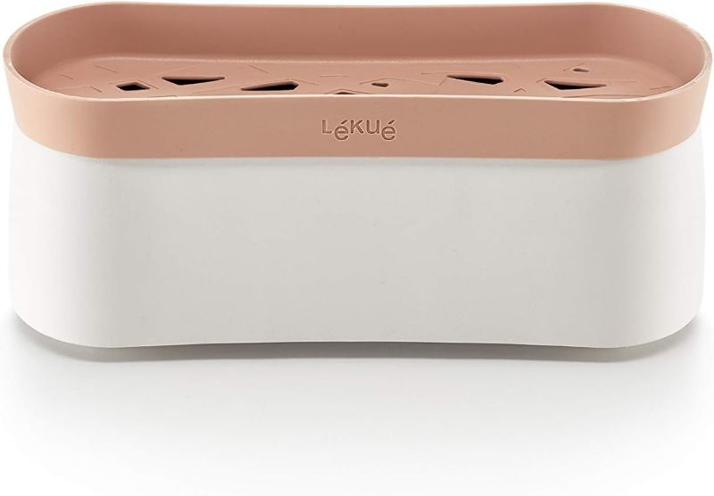

# Lékué Recipiente Quick Pasta
<figure class="polaroid-box">
    
    <figcaption class="polaroid-caption">It really works</figcaption>
</figure>

Having been on shift work a while and needing some pasta added to the meal list we bought one of these :!

125g of Pasta and 300ml of water cooked for 10 minutes gives perfect al-dente pasta for one, just add meat and sauce, or in my case after the dentist visit just add grated cheese. 

We later found it really doesn't like wholemeal pasta, they don't cook well and they stick together. It's fine for normal pasta.
