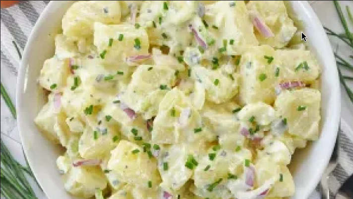

## Ingredients
2 1/4 lbs waxy potatoes 1 kilogram

2 large eggs

1/3 cup chopped red onion 50 grams

2 celery sticks (thinly sliced)

1/4 cup chopped dill pickles 35 grams

2 tbsp chopped chives 6 grams

3/4 cup low fat Greek yogurt 180 grams

1 tbsp dijon mustard 15 grams

1/2 tbsp white wine vinegar 8 ml

2 tbsp extra virgin olive oil 30 ml

sea salt & black pepper

chopped chives for garnish

## Instructions
Cut the potatoes (peeled) into small bite-sized pieces that are 3/4 inch (2 cm) thick, then add them into a stock pot, fill with water just enough to cover the potatoes, season generously with salt, and heat with a high heat

In the meantime, add the eggs into a saucepan, then fill with water just enough to cover the eggs, heat with a high heat, once it comes to a boil, place a lid on the pan and turn off the heat, let the eggs sit there for 10 minutes to end up with perfectly hard boiled eggs

After about 20 minutes the potatoes should be cooked through, you can always pierce them with a toothpick to ensure they are done (don't over boil the potatoes, otherwise they will break apart), remove the stockpot from the heat and drain into a colander, rinse the potatoes under cold water, then shake off any excess water, and transfer the potatoes into a large bowl

Add the Greek yogurt into a separate bowl, along with the dijon mustard, vinegar, olive oil, garlic, and season with salt & pepper, whisk together

Add the creamy dressing over the potatoes, along with the hard boiled eggs finely chopped, the choped red onion, sliced celery, chopped dill pickels, and chopped chives, season with salt & pepper, mix together until well mixed

Serve at room temperature or even chilled, topped off with some chopped chives, enjoy!

Source: [Spain On A Fork](https://spainonafork.com/no-mayo-creamy-potato-salad-recipe/)
