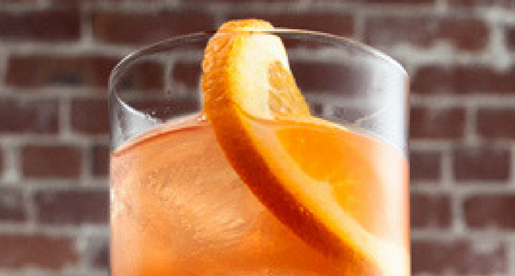

INGREDIENTS IN THE SEX ON THE BEACH COCKTAIL

1 1⁄2 parts Vodka

1⁄2 parts Peach schnapps

1 1⁄2 parts Orange or pineapple juice

1 1⁄2 parts Cranberry juice

1⁄2 parts Chambord or crème de cassis (optional)

Garnish: 1 Orange wheel

Glass: Highball HOW TO MAKE THE SEX ON THE BEACH COCKTAIL

Add all the ingredients to a shaker or blender and fill with ice.

Shake, and strain into a highball glass filled with fresh ice.

Garnish with an orange wheel.

PROFILE

Flavor: Fruity/Citrus-forward Sweet

Base Spirit: Vodka

Cocktail Type: Tiki / Tropical

Served: On the Rocks

Preparation: Shaken

Strength: Medium

Difficulty: Medium

Hours: Afternoon Evening