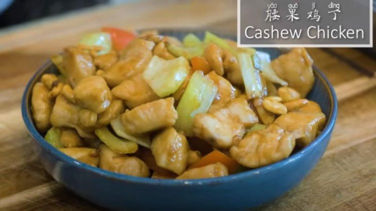

INGREDIENTS

To marinate the chicken
* 1 lb (454 grams) of chicken breast
* 1/3 tsp of salt
* 1/3 tsp of baking soda
* White pepper to taste 
* 2.5 tsp of cornstarch
* 1.5 tbsp of Chinese cooking wine

For the sauce
* 1.5 tbsp of soy sauce 
* ~~1 tbsp of oyster sauce ~~
* 1 tbsp of hoisin sauce
* 1 tbsp of ketchup
* 2 tbsp of water

To stir fry
* 2-3 tbsp of vegetable oil
* ~~3 cloves of garlic, sliced thinly
* 1/2 inch of ginger, sliced thinly~~
* 1/2 of bell pepper, cut into bite-size
* 2 stalks of celery, cut into bite-size
* 2 tbsp of scallion, diced
* 1/2 cup of cashew, toasted

INSTRUCTIONS
Cut 1 lb of chicken breast into bite-size pieces. You can also use chicken thigh if you want.

Marinate it with 1/3 tsp of salt and 1/3 tsp of baking soda, some white pepper to taste, 2.5 tsp of cornstarch, and 1.5 tbsp of Chinese cooking wine. Gently rub for a few minutes or until the chicken feels velvety.

In a bowl, combine the following ingredients and set it aside: 1.5 tbsp of soy sauce, 1 tbsp of oyster sauce, 1 tbsp of hoisin sauce, 1 tbsp of ketchup, 2 tbsp of water.

Turn the heat to high and heat the wok until it is smoking hot. Add some oil and toss it around to create a nonstick layer.

Add the chicken and stir for 2-3 minutes or until the chicken changes color. Turn off the heat and take the chicken out. Make sure you tilt the wok to leave the oil behind.

Turn the heat back on medium, use the remaining oil to saute the garlic, ginger, scallion, and celery. Stir over medium heat for a couple of minutes. 

Pour in the sauce and introduce the chicken back into the wok. Keep mixing for another 2-3 minutes or until the chicken is cooked through; Then, add the bell pepper and the roasted cashews. Give it a final toss. That’s it, you are done.

This recipe is from [Souped Up Recipes](https://www.youtube.com/channel/UC3HjB3X8jeENm46HCkI0Inw) the strikeout lines are things I can't eat so removed for my reference, follow the actual recipe if you can.

[plugin:youtube](https://www.youtube.com/watch?v=gqYUYAhwffM)
