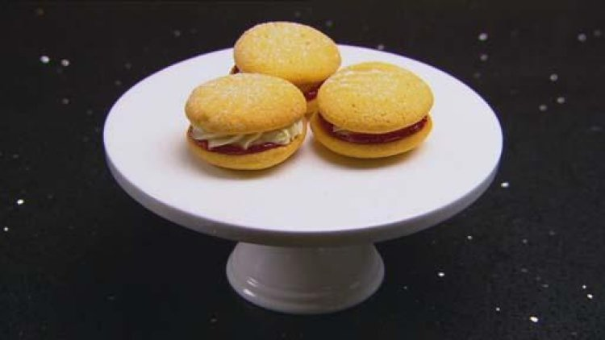

Makes: 10 sandwiched biscuits

Ingredients

Biscuits

180gunsalted butter

60gicing sugar, sifted

60gcornflour

1 teaspoonbaking powder

180gplain flour

Vanilla buttercream

100gbutter, softened

2 teaspoonsvanilla bean paste

1 cupicing sugar, sifted

Raspberry jam

250gfresh or frozen raspberries

250gcaster sugar

Juice of ½ a lemon

½ teaspoongelatine powder

Icing sugar, to serve

Method

Preparation: 30 minutes
Cooking: 50 minutes

1. Preheat oven to 180°C. Line two oven trays with baking paper.

2. For biscuits, cream butter for two minutes in an electric mixer with paddle attachment. Add icing sugar and custard powder and mix until combined. Sift the baking powder and flour together then add to the dough and mix well. Roll dough into 20g balls, place on a baking paper lined baking tray and press each ball with a fork to leave an indent. Bake biscuits for 16-18 minutes or until light golden. Stand on trays 5 minutes to cool then transfer to a wire rack to cool completely.

3. For buttercream, whisk butter and vanilla until smooth. Add icing sugar and beat until mixture forms a paste, the consistency of thick icing. Spoon into a piping bag fitted with a small star nozzle.

4. For jam, place raspberries, sugar and lemon juice in a small saucepan and cook for 20-30 minutes until thickened. Mix gelatine powder with one tablespoon cold water together. Remove the jam from the heat, stir through gelatine mixture. Transfer to a heatproof bowl and cool in the fridge.

5. To assemble, place a spoonful of cooled jam on the base of half the biscuits. Pipe buttercream in a circle onto the base of the other half of the biscuits. Gently press one of each biscuit together to form a melting moment.

Dust with icing sugar before serving.
