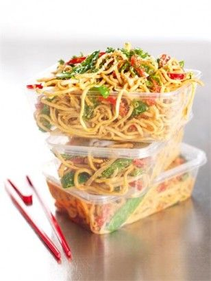

Ingredients

for the dressing
1 tablespoon sesame oil
1 tablespoon garlic infused olive oil
1 tablespoon soy sauce
2 tablespoons sweet chilli sauce
100 grams smooth peanut butter
2 tablespoons lime juice

for the salad
125 grams mangetout (snow peas)
150 grams beansprouts (rinsed)
1 red pepper (deseeded and cut into small strips)
2 spring onions (finely sliced)
550 grams egg noodles (ready prepared)
20 grams sesame seeds
4 tablespoons chopped fresh coriander/

Method
1.  Whisk together all the dressing ingredients in a bowl or jug.
2.  Put the mangetout, beansprouts, red pepper strips, sliced spring onions and the noodles into a bowl.
3.  Pour the dressing over them and mix thoroughly to coat everything well.
4.  Sprinkle with the sesame seeds and chopped coriander and pack up as needed.

